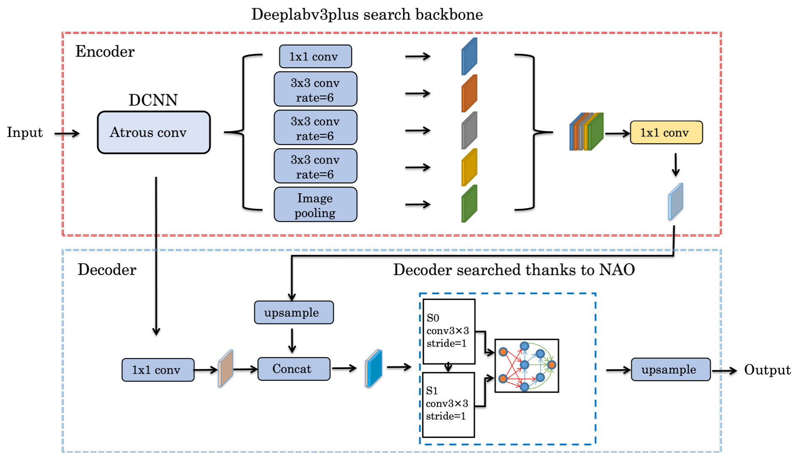
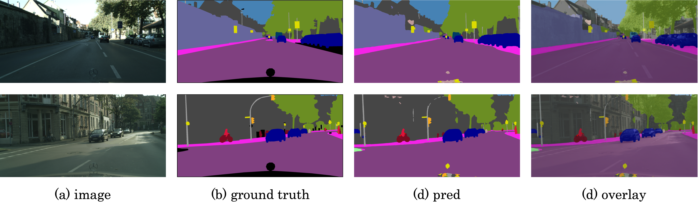
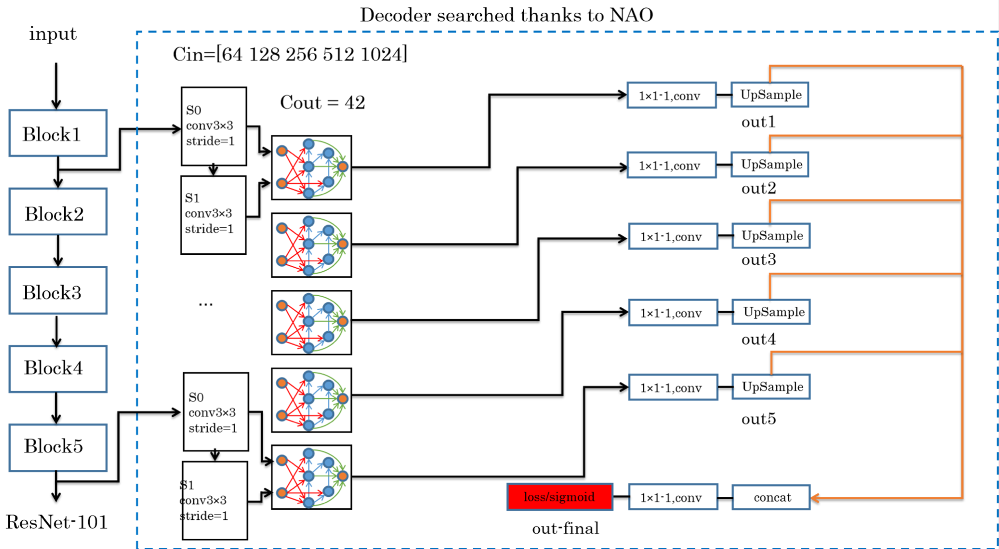
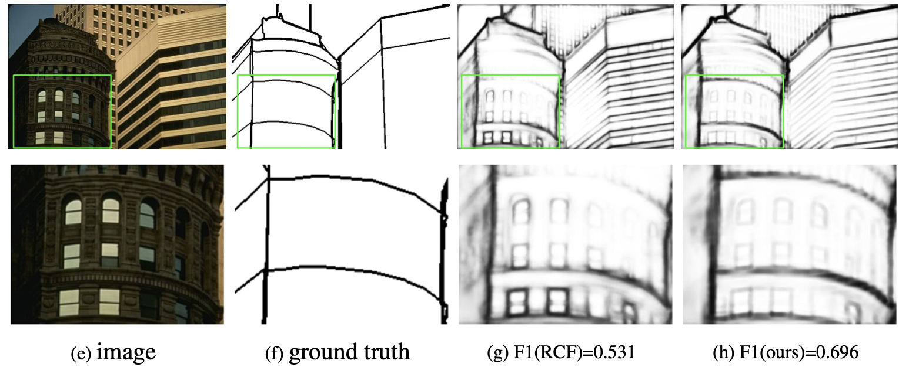

## Learning Deep Morphological Networks with Neural Architecture Search

Yufei Hua,∗, Nacim Belkhirb, Jesus Anguloc, Angela Yaod, Gianni Franchia,∗

a[yufei.hu.2021,gianni.franchi]@ensta-paris.fr, U2IS, ENSTA Paris, Institut Polytechnique de Paris

bnacim.belkhir@safrangroup.com, Safrantech, Safran Group 

cjesus.angulo@mines-paristech.fr, CMM, Mines ParisTech, PSL Research University 

  

dayao@comp.nus.edu.sg,School of Computing National University of Singapore

 

&nbsp; &nbsp; &nbsp; &nbsp;&nbsp; &nbsp; &nbsp; &nbsp;&nbsp; &nbsp; &nbsp; &nbsp;&nbsp; &nbsp; &nbsp; &nbsp;&nbsp; &nbsp; &nbsp; &nbsp;&nbsp; &nbsp; &nbsp; &nbsp;&nbsp; &nbsp; &nbsp; &nbsp;&nbsp; &nbsp; &nbsp; &nbsp;&nbsp; &nbsp; &nbsp; &nbsp;[Paper](https://arxiv.org/abs/2106.07714) &nbsp; &nbsp; &nbsp; &nbsp; [Code](https://github.com/nao-morpho/nao-morpho.github.io)

<a href=https://arxiv.org/abs/2106.07714>Paper\</a> &nbsp; &nbsp; &nbsp; &nbsp; <a href=https://github.com/nao-morpho/nao-morpho.github.io>Code\</a>
 

### Abstract
Deep Neural Networks (DNNs) are generated by sequentially performing linear and non-linear processes. Using a combination of linear and non-linear proce- dures is critical for generating a sufficiently deep feature space. The majority of non-linear operators are derivations of activation functions or pooling functions. Mathematical morphology is a branch of mathematics that provides non-linear operators for a variety of image processing problems. We investigate the util- ity of integrating these operations in an end-to-end deep learning framework in this paper. DNNs are designed to acquire a realistic representation for a par- ticular job. Morphological operators give topological descriptors that convey salient information about the shapes of objects depicted in images. We propose a method based on meta-learning to incorporate morphological operators into DNNs. The learned architecture demonstrates how our novel morphological operations significantly increase DNN performance on various tasks, including picture classification, edge detection and semantic segmentation.

### Segmentation

### Edge detection

